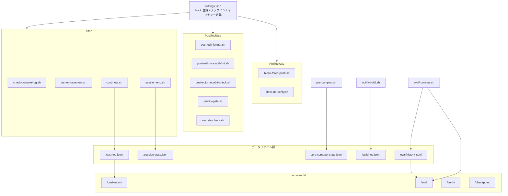

# 07 — Harness Infrastructure（Claude Code 自動化基盤）

> `.claude/commands/`, `.claude/eval/`, `.claude/hooks/` の設計と動作を解説する。
> これらのファイルは [everything-claude-code](https://github.com/affaan-m/everything-claude-code) v1.8.0 の `/harness-audit` コマンドで生成されたものをベースに、whirlwind プロジェクト固有にカスタマイズしたものである。

---

## 1. 全体像 — 三つのファイル群の役割

```
.claude/
├── commands/   ← ユーザーが明示的に起動するワークフロー（スラッシュコマンド）
├── eval/       ← プロジェクト品質を定量計測するハーネス
├── hooks/      ← Claude Code のライフサイクルに自動的に介入するスクリプト群
└── settings.json  ← 上記すべてを結合する中央設定
```

| ファイル群 | Why（なぜ存在するか） | What（何をするか） | How（どう動くか） |
|---|---|---|---|
| **commands/** | AI エージェントに「定型作業」を一言で指示したい | スラッシュコマンド（`/checkpoint`, `/verify` 等）として呼び出し可能なワークフロー定義 | Markdown で手順を宣言。Claude Code がコマンドとして認識し、手順通りに実行する |
| **eval/** | コード品質の合否を **数値で** 追跡したい | 全品質ゲートを一括実行し、pass@1 を算出。履歴を JSONL に蓄積 | シェルスクリプトが `moon fmt`, `moon check`, `tsc`, テスト等を順次実行 |
| **hooks/** | エージェントの操作ミスを **自動で** 防止・検知したい | ファイル編集・コミット・セッション終了等のタイミングで自動実行されるガードレール | `settings.json` にイベント×マッチャーで登録。Claude Code が該当イベント発火時に自動実行 |

### 依存の方向

```
commands/  ────呼び出す────→  eval/run-eval.sh
commands/  ────読み取る────→  hooks が生成するデータファイル（.cost-log.jsonl 等）
hooks/     ────登録先──────→  settings.json（中央設定）
eval/      ────実行対象────→  プロジェクトのビルド・テスト基盤（moon, tsc, node --test）
```

- **hooks/** が最も基盤的。他の二群はこれなしでも動くが、hooks がなければ品質ゲートは手動実行のみになる。
- **eval/** は commands/ から呼ばれる。単独でも `bash .claude/eval/run-eval.sh` で実行可能。
- **commands/** は最上位。ユーザーインターフェースとしてすべてを束ねる。

---

## 2. Hooks — 自動介入スクリプト群

### 2.1 Why — なぜ hooks が必要か

Claude Code エージェントは高い自律性を持つが、以下の問題を機械的に防止する仕組みがないと事故につながる：

- **破壊的 git 操作**（force push, hook スキップ）によるリモートリポジトリの汚染
- **フォーマット崩れ**の蓄積（prettier, moon fmt の適用漏れ）
- **型エラー**の見落とし（MoonBit / TypeScript の型チェック未実施）
- **シークレットの混入**（API キー、パスワードのハードコード）
- **console.log の残留**（デバッグコードの本番混入）
- **テスト未実行**でのセッション終了
- **コンテキスト消失**（compaction でセッション状態が失われる）

hooks はこれらを **人間の注意力に依存せず、自動的に** 処理する。

### 2.2 What — 4 つの防御レイヤー

hooks は実行タイミングによって 4 つのレイヤーを形成する：

```
[Safety Layer]       PreToolUse    ── ツール実行「前」に危険な操作をブロック
[Quality Layer]      PostToolUse   ── ファイル編集「後」に品質チェックを自動実行
[Verification Layer] Stop          ── セッション終了「時」に最終検証
[Observability Layer] SessionStart / PreCompact / Notification / Stop
                                   ── セッション状態・コスト・ビルドログの記録
```

### 2.3 How — レイヤー別詳細

#### 2.3.1 Safety Layer（PreToolUse）

**トリガー**: `Bash` ツール実行前

| ファイル | 目的 | ブロック条件 | 許可される代替手段 |
|---|---|---|---|
| `block-force-push.sh` | リモート履歴の破壊を防止 | `git push --force`, `git push -f` | `--force-with-lease`（安全な強制プッシュ） |
| `block-no-verify.sh` | commit hook のバイパスを防止 | `--no-verify`, `--no-gpg-sign`, `git commit -n` | なし（hook は必ず実行すべき） |

**動作原理**: stdin から JSON を受け取り、`tool_input.command` フィールドを正規表現でスキャン。マッチすれば exit 2（ブロック）を返す。`--force-with-lease` は `sed` で除外してから `--force` をチェックするため、安全な代替手段は許可される。

#### 2.3.2 Quality Layer（PostToolUse）

**トリガー**: `Edit` または `Write` ツール実行後（マッチャー: `Edit|Write`）

| ファイル | 対象 | 処理 | エラー時の挙動 |
|---|---|---|---|
| `post-edit-format.sh` | `*.js`, `*.mjs`, `*.ts`, `*.mts` | `npx prettier --write` → `--check` で検証 | `hookSpecificOutput` で警告メッセージを返す |
| `post-edit-moonbit-fmt.sh` | `*.mbt` | `moon fmt` → `moon fmt --check` で検証 | 同上 |
| `quality-gate.sh` | `*.mts` | `npx tsc --noEmit -p tsconfig.sdk.json` | 型エラーを `hookSpecificOutput` で報告 |
| `post-edit-moonbit-check.sh` | `*.mbt` | `moon check --target js` | MoonBit 型エラーを報告 |
| `secrets-check.sh` | 全ファイル（バイナリ除く） | AWS Key (`AKIA...`), API Key (`sk-...`), パスワード代入, GitHub Token (`ghp_...`) を検知 | 検知結果を警告として報告 |

**動作原理**: stdin JSON から `tool_input.file_path` を抽出し、拡張子でフィルタ。対象ファイルに対してフォーマッタ/チェッカーを実行。エラーは `jq` で `hookSpecificOutput.additionalContext` を構築し、Claude Code のコンテキストに注入する（セッションは中断しない）。

**実行順序と設計意図**:
1. **フォーマット** (format.sh, moonbit-fmt.sh) → まずコードを整形
2. **型チェック** (quality-gate.sh, moonbit-check.sh) → 整形後のコードを検証
3. **シークレット検知** (secrets-check.sh) → 最後にセキュリティスキャン

#### 2.3.3 Verification Layer（Stop）

**トリガー**: セッション終了時（すべてのツールマッチ `*`）

| ファイル | 目的 | 動作 |
|---|---|---|
| `check-console-log.sh` | デバッグコードの残留を防止 | 変更された JS/TS ファイル（テスト除く）から `console.log` を検索。コメント行は除外。見つかれば警告 |
| `test-enforcement.sh` | SDK 変更時のテスト未実行を防止 | `sdk/*.mts`, `sdk/*.mjs` に変更があれば `node --test sdk/*.test.mjs` を実行。60 秒タイムアウト付き |

**test-enforcement.sh の特筆事項**:
- macOS 互換のタイムアウト実装（`coreutils` の `timeout` に依存しない）
- バックグラウンドプロセスとして `node --test` を起動し、1 秒間隔でポーリング
- テスト出力は末尾 80 行に切り詰めて JSON に収める

#### 2.3.4 Observability Layer（複数イベント横断）

| ファイル | イベント | 出力先 | 記録内容 |
|---|---|---|---|
| `session-start.sh` | SessionStart | stdout（コンテキストに注入） | 日付、ブランチ、前回コミットからの変更、未コミット変更 |
| `session-end.sh` | Stop | `.claude/.session-state.json` | タイムスタンプ、ブランチ、変更ファイル一覧、最終コミット |
| `pre-compact.sh` | PreCompact | `.claude/.pre-compact-state.json` | ブランチ、変更ファイル、直近 5 コミット、進行中 beads チケット |
| `cost-note.sh` | Stop | `.claude/.cost-log.jsonl` | タイムスタンプ、ブランチ、変更ファイル数 |
| `notify-build.sh` | Notification | `.claude/.build-log.jsonl` | ビルド/テスト関連通知のサマリ（先頭 200 文字） |

**データの流れ**:
```
session-start.sh ──→ [stdout] ──→ Claude Code セッションコンテキスト
session-end.sh   ──→ .session-state.json ──→ 次回セッション開始時の参照
pre-compact.sh   ──→ .pre-compact-state.json ──→ compaction 後のコンテキスト復旧
cost-note.sh     ──→ .cost-log.jsonl ──→ /cost-report コマンドで分析
notify-build.sh  ──→ .build-log.jsonl ──→ ビルド履歴の追跡
```

### 2.4 Hook 設定ファイル

#### settings.json（中央登録）

すべての hook は `.claude/settings.json` の `hooks` セクションに登録されている。これが**唯一の有効な設定**。

```json
{
  "hooks": {
    "PreToolUse":   [ { "matcher": "Bash",       "hooks": [...] } ],
    "PostToolUse":  [ { "matcher": "Edit|Write", "hooks": [...] } ],
    "Stop":         [ { "matcher": "*",          "hooks": [...] } ],
    "SessionStart": [ { "matcher": "*",          "hooks": [...] } ],
    "PreCompact":   [ { "matcher": "*",          "hooks": [...] } ],
    "Notification": [ { "matcher": "*",          "hooks": [...] } ]
  }
}
```

#### 個別 config JSON（参考用フラグメント）

以下の 3 ファイルは、`/harness-audit` が生成したオリジナルの設定フラグメント。現在は `settings.json` に統合済みのため、**参考資料としてのみ存在する**。

| ファイル | 内容 |
|---|---|
| `cost-hooks-config.json` | `cost-note.sh` を Stop hook として登録 |
| `session-hooks-config.json` | `session-start.sh` を SessionStart、`session-end.sh` を Stop として登録 |
| `stop-hooks-config.json` | `check-console-log.sh` と `test-enforcement.sh` を Stop hook として登録 |

---

## 3. Commands — スラッシュコマンド

### 3.1 Why — なぜコマンドが必要か

hooks が「自動介入」であるのに対し、commands は「手動トリガー」。以下のユースケースを一言で起動できるようにする：

- セッション途中の安全なチェックポイント作成
- 品質ゲートの一括実行と結果確認
- コスト分析と最適化提案
- タスク複雑度に応じたモデル選択

### 3.2 What/How — 各コマンドの詳細

#### `/checkpoint` — 作業状態の保存

```
目的: セッション途中の安全な復帰地点を作る
手順: just test → git status → git stash create → ハッシュ報告
依存: just (テスト基盤), git
```

テストを通した上で `git stash create` によるリファレンスを作成する。`git stash` と異なり、作業ツリーの状態は変えない（非破壊的）。

#### `/cost-report` — コスト分析レポート

```
目的: セッションのコスト傾向を可視化し、最適化を提案する
入力: .claude/.cost-log.jsonl（cost-note.sh hook が蓄積）
出力: セッション数、日別分布、変更ファイル数平均、トークン使用量推定、最適化提案
依存: cost-note.sh hook（データ供給元）
```

hooks の Observability Layer が蓄積したデータを消費する。hooks → データ → command の流れ。

#### `/eval` — 品質評価ハーネス

```
目的: 全品質ゲートの pass@1 を計測し、経時変化を追跡する
手順: bash .claude/eval/run-eval.sh → 結果報告 → 履歴比較 → 改善提案
依存: eval/run-eval.sh, eval/history.jsonl（履歴）
```

commands/ と eval/ の接続点。詳細は「4. Eval」で述べる。

#### `/model-route` — モデル選択アドバイザ

```
目的: タスク複雑度に応じた最適モデルを推薦する
入力: タスクの説明文
出力: 推奨モデル、信頼度、理由、フォールバックモデル
```

| モデル | 適用タスク |
|---|---|
| haiku | フォーマット、import 整理、単純リネーム、機械的変更 |
| sonnet | 機能実装、テスト記述、バグ修正、リファクタリング |
| opus | アーキテクチャ設計、セキュリティレビュー、仕様策定、曖昧な要件 |

`.claude/token-budget.json` にモデル選択の指針が記載されているが、このファイルはどのスクリプトからも機械的に参照されておらず、人間・エージェントが方針を確認するための参考資料である。

#### `/verify` — フル検証パイプライン

```
目的: whirlwind プロジェクトの全品質ゲートを一括実行し、修正まで行う
手順:
  1. Format check:   moon fmt --check + npx prettier --check
  2. Static analysis: moon check --target js + npx tsc --noEmit
  3. Tests:          just test
  4. E2E:            just mock
出力: 結果テーブル + 失敗箇所の自動修正
```

hooks の PostToolUse が「ファイル単位」で実行するチェックを、「プロジェクト全体」に対して一括実行するコマンド。hooks が「局所的・自動」、verify が「全体的・手動」という補完関係。

---

## 4. Eval — 品質計測ハーネス

### 4.1 Why — なぜ eval が必要か

hooks と commands は品質を「維持」するが、品質の「推移」は追跡できない。eval はプロジェクト品質を定量的に計測し、時系列で比較可能にする。

### 4.2 What — pass@1 計測

`run-eval.sh` は以下の 6 つの品質ゲートを順次実行し、各ゲートの合否を記録する：

| ゲート名 | 実行コマンド | 検証内容 |
|---|---|---|
| `moon-fmt` | `moon fmt --check` | MoonBit コードのフォーマット |
| `moon-check` | `moon check --target js` | MoonBit の型チェック |
| `build-sdk` | `npm run -s build:sdk` | SDK ビルド成功 |
| `prettier` | `npx prettier --check 'sdk/**/*.{mts,mjs}'` | JS/TS のフォーマット |
| `node-tests` | `node --test sdk/*.test.mjs` | SDK ユニットテスト |
| `moon-tests` | `moon test --target js` | MoonBit ユニットテスト |

### 4.3 How — 実行と履歴管理

```bash
# 実行
bash .claude/eval/run-eval.sh

# 出力例
=== whirlwind eval harness ===
date: 2026-03-28T12:00:00Z

--- results ---
  PASS  moon-fmt
  PASS  moon-check
  PASS  build-sdk
  PASS  prettier
  PASS  node-tests
  PASS  moon-tests

pass@1: 6/6
```

**履歴**: 実行ごとに `.claude/eval/history.jsonl` に追記される。

```json
{"date":"2026-03-28T12:00:00Z","pass":6,"total":6,"fail":0}
```

`/eval` コマンドはこの履歴を読み、前回との差分を報告する。

---

## 5. 設定ファイルとデータファイル

### 5.1 設定ファイル

| ファイル | 役割 |
|---|---|
| `settings.json` | hook 登録、プラグイン有効化（everything-claude-code, security-guidance, magna）|
| `settings.local.json` | ローカル権限設定（許可ドメイン、許可コマンド、サンドボックス無効化）|
| `token-budget.json` | モデルルーティングの指針メモ（デフォルト: sonnet, 予算: $5/セッション）。**参考資料のみ — どのスクリプトからも参照されていない** |

### 5.2 データファイル（hooks が生成）

| ファイル | 生成元 | 形式 | 用途 |
|---|---|---|---|
| `.cost-log.jsonl` | `cost-note.sh` | JSONL（追記） | `/cost-report` で分析 |
| `.session-state.json` | `session-end.sh` | JSON（上書き） | 次回セッションの文脈復旧 |
| `.pre-compact-state.json` | `pre-compact.sh` | JSON（上書き） | compaction 後の文脈復旧 |
| `.build-log.jsonl` | `notify-build.sh` | JSONL（追記） | ビルド履歴追跡 |
| `eval/history.jsonl` | `run-eval.sh` | JSONL（追記） | 品質推移の追跡 |

---

## 6. 依存関係マップ

### ファイル間の依存



### 役割の依存関係

```
安全性保証 ←── Safety Layer (PreToolUse)
    ↓
品質維持   ←── Quality Layer (PostToolUse) + Verification Layer (Stop)
    ↓
品質計測   ←── Eval (run-eval.sh)
    ↓
品質改善   ←── Commands (/verify, /eval → 改善提案)
    ↓
コスト管理 ←── Observability Layer + /cost-report + /model-route
```

安全性が基盤にあり、その上に品質維持 → 計測 → 改善 → コスト最適化が階層的に積み上がる構造。

---

## 7. everything-claude-code /harness-audit との関係

`/harness-audit` は everything-claude-code v1.8.0 が提供するコマンドで、プロジェクトの技術スタック（言語、ビルドツール、テストフレームワーク）を解析し、以下を自動生成する：

1. **hooks/**: プロジェクトの言語に合わせたフォーマッタ・型チェッカー・安全ガードを生成
2. **eval/**: プロジェクトのビルド・テストコマンドに基づく品質ゲートスクリプトを生成
3. **commands/**: 汎用コマンド + プロジェクト固有の検証パイプラインを生成
4. **\*-config.json**: hook 設定フラグメントを生成（後で settings.json に統合）

whirlwind プロジェクトでは、MoonBit + TypeScript というデュアルスタック構成が検出され、両言語に対応する hook が生成されている。これが `post-edit-moonbit-*.sh`（MoonBit 固有）と `post-edit-format.sh` / `quality-gate.sh`（TypeScript 固有）が並存する理由。
